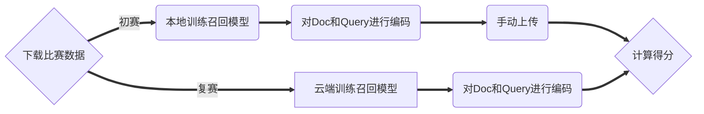

## 比赛介绍

受疫情催化影响，近一年内全球电商及在线零售行业进入高速发展期。作为线上交易场景的重要购买入口，搜索行为背后是强烈的购买意愿，电商搜索质量的高低将直接决定最终的成交结果，因此在AI时代，如何通过构建智能搜索能力提升线上GMV转化成为了众多电商开发者的重要研究课题。**本次比赛由阿里云天池平台和问天引擎联合举办，诚邀社会各界开发者参与竞赛，共建AI未来。**


## 比赛内容

本次题目围绕电商领域搜索算法，开发者们可以通过基于阿里巴巴集团自研的高性能分布式搜索引擎问天引擎（提供高工程性能的电商智能搜索平台），可以快速迭代搜索算法，无需自主建设检索全链路环境。

 **本次评测的数据来自于淘宝搜索真实的业务场景，其中整个搜索商品集合按照商品的类别随机抽样保证了数据的多样性，搜索Query和相关的商品来自点击行为日志并通过模型+人工确认的方式完成校验保证了训练和测试数据的准确性。** 

比赛形式分为初赛和复赛两部分，分别从向量召回角度和精排模型角度让选手比拼算法模型。

- `初赛`：提供HA3环境，让选手PK向量召回模型的效果，选手拿到100万全量Doc和10万对Query-Doc相关训练集，自行训练向量召回模型。选手每次提交的内容为100万全量Doc通过模型转换的embedding（固定维度，如128）以及测试集1000条Query转换的embedding。我们通过回流数据，建向量索引，查询测试，给出评测指标（MRR@10，正确Doc排的位置越靠前分越高）。

- `复赛`：对于进入到复赛的选手开放精排模型的PK，选手需要在PAI上按照我们要求的模型格式训练精排模型。选手每次提交的内容除了初赛的Doc和Query的embedding，还包括训练好的精排模型。我们通过回流数据，建向量索引，查询测试（该阶段会做超时限制，防止选手无限制扩大模型复杂度），给出评测指标。



## 比赛数据


### corpus.tsv

- 介绍：语料库，从淘宝商品搜索的标题数据随机抽取doc，量级约100万。
- 格式：`doc_id`从1开始编号的，`title`是是商品标题。

```
1 铂盛弹盖文艺保温杯学生男女情侣车载时尚英文锁扣不锈钢真空水杯
2 可爱虎子华为荣耀X30i手机壳荣耀x30防摔全包镜头honorx30max液态硅胶虎年情侣女卡通手机套插画呆萌个性创意
3 190色素色亚麻棉平纹布料 衬衫裙服装定制手工绣花面料 汇典亚麻
4 松尼合金木工开孔器实木门开锁孔木板圆形打空神器定位打孔钻头
5 微钩绿蝴蝶材料包非成品 赠送视频组装教程 需自备钩针染料
6 春秋薄绒黑色打底袜女外穿高腰显瘦大码胖mm纯棉踩脚一体连袜裤
7 New Balance/NB时尚长款过膝连帽保暖羽绒服女外套NCNPA/NPA46032
8 2021博洋高级l拉舍尔云毯结婚庆毛毯子冬季加厚保暖被子珊瑚
9 玉手牌平安无事牌天然翡翠a货男女款调节编织玉手链冰种玉石手串
10 欧货加绒拼接开叉纽扣烟管裤女潮2021秋季高腰显瘦九分直筒牛仔裤
```


### train.query.txt
- 介绍：训练集的query，训练集量级为10万。
- 格式：`query_id`从1开始编号，`query`是搜索日志中抽取的查询词。

```
1 unidays
2 溪木源樱花奶盖身体乳
3 除尘布袋工业
4 双层空气层针织布料
5 4812锂电
6 鈴木雨燕方向機總成
7 福特翼搏1.5l变速箱电脑模块
8 a4红格纸
9 岳普湖驴乃
10 婴儿口罩0到6月医用专用婴幼儿
```


### qrels.train.tsv
- 介绍：训练集的query与doc对应关系，训练集量级为10万。
- 格式：`query_id`和`doc_id`。数据来自于搜索点击日志，人工标注query和doc之间具备高相关性，训练集用来训练模型。

```
1 28
2 37
3 51
4 52
5 77
```

### dev.query.txt
- 介绍：测试集的query，测试集量级为1000。
- 格式：`query_id`和`query`，训练集id从1开始编号，测试集id从200001开始编号，query是搜索日志中抽取的查询词。

```
200001 鈴木雨燕方向機總成
200002 福特翼搏1.5l变速箱电脑模块
200003 a4红格纸
200004 岳普湖驴乃
200005 婴儿口罩0到6月医用专用婴幼儿
```

注：比赛数据文件列之间的分隔符均为tab符（\t）

## 结果提交

### 初赛

选手上传数据格式：评测数据必须包括doc_embedding，query_embedding两个文件，文件名必须固定，文件打包为.tar.gz格式的压缩包

如： `tar zcvf foo.tar.gz doc_embedding query_embedding`

注意：请严格遵守下面要求的文件内容和格式，才能顺利得到结果，提交前也可以使用比赛提供的数据校验脚本检查通过后再进行打包提交。
脚本使用方式：将脚本data_check.py与待提交文件doc_embedding和query_embedding放在相同目录，执行python data_check.py

- doc_embedding：语料库embedding，100万语料库通过选手训练的向量召回模型转化后的向量，维度限制128维。

格式：doc_id embedding

```1	0.078739,0.282391,0.298502,-0.294370,-0.166545,-0.013302,0.369835,0.650909,-0.180876,0.344435,-0.511384,-0.600136,0.876170,0.595053,0.529620,0.313576,0.069411,0.794169,0.424571,0.226918,-0.652573,0.009937,0.046894,-0.072549,0.180052,0.311451,0.062532,0.477394,0.066133,0.548474,0.106401,0.449037,0.557605,0.318793,-0.500357,0.160880,-0.738819,0.250867,-0.122692,-0.743531,0.297371,0.348448,0.565187,0.782533,-0.468554,0.115671,0.387320,0.090747,0.474048,-0.262481,0.439003,0.860079,0.795876,0.674476,-0.391774,-0.751113,-0.248353,-0.033272,0.529141,-0.078997,-0.296786,0.053545,-0.573510,-0.500531,0.848892,0.055240,0.316602,0.426072,-0.118691,0.613708,0.043924,-0.370509,0.630920,-0.280416,0.012843,0.158447,0.194989,-0.546903,0.440936,-0.634484,0.362358,0.208168,0.525906,-0.364060,-0.019356,0.629384,0.332850,0.348769,0.444354,0.171443,-0.498889,0.150438,-0.080280,0.007969,-0.003882,-0.355891,-0.565994,-0.751133,-0.769314,0.448398,0.384470,0.091455,0.662950,0.441133,0.167109,0.942066,-0.236464,0.449114,0.519677,0.432361,0.625516,0.518622,-0.133762,0.032810,-0.323678,0.440681,0.320589,-0.447725,-0.215608,-0.675732,-0.933527,-0.246847,-0.178769,-0.141269,-0.515197,-0.485108,0.170341,0.001802
2	-0.540838,0.699483,-0.451327,0.086697,-0.054457,-0.499051,0.003682,0.386219,0.789026,0.288511,-0.133612,-0.295615,0.777499,0.446981,0.467732,0.289793,0.056430,0.239342,0.394474,0.739930,0.115619,0.400768,-0.688479,-0.245249,0.401545,0.067654,-0.406273,0.631079,-0.426185,-0.050901,0.822377,0.156809,0.470805,0.389092,-0.304748,0.460465,-0.340481,-0.423877,0.524095,-0.464753,-0.258779,0.044986,0.657499,0.020781,-0.231213,0.624265,-0.439564,-0.086296,-0.299126,-0.656638,0.563738,0.211103,-0.039345,-0.314355,-0.332023,-0.639921,0.253654,-0.688456,0.599655,-0.322762,0.377239,0.328488,-0.116180,-0.447221,-0.694954,0.099366,0.182083,-0.030348,0.495848,0.014681,-0.854940,0.079997,0.103800,0.755586,0.225769,-0.611819,0.838259,0.036218,-0.601004,0.192454,-0.409465,0.092632,-0.603502,0.159294,0.429040,0.369765,-0.726122,0.733279,-0.024388,-0.124334,-0.579293,0.445816,0.372260,0.145361,-0.458661,-0.613036,-0.436888,-0.237132,0.201241,-0.383260,-0.467477,-0.055167,-0.631041,-0.695114,-0.106460,-0.263603,0.310081,-0.170549,0.330076,0.695804,-0.587648,0.725412,0.251732,0.619346,-0.192143,0.415200,0.746687,0.077549,0.100267,-0.837646,-0.472764,-0.608654,-0.643243,-0.529133,-0.160022,-0.163062,0.878883,0.207523
```

- query_embedding：测试集embedding，1000条测试集query通过选手训练的向量召回模型转化后的向量，维度限制128维。

格式：query_id embedding

```
200001	-0.135404,0.803930,0.504797,0.069186,0.167831,-0.338120,-0.661929,0.195884,0.486813,0.417895,0.482173,0.209041,0.872994,-0.828141,0.728383,0.356425,0.759754,-0.052395,0.507669,0.215317,-0.192724,0.354297,-0.180966,0.227305,0.059949,-0.032830,-0.689066,-0.136598,-0.149492,0.614751,-0.121169,0.078482,0.830174,0.314577,-0.656824,-0.453853,-0.112618,0.255748,-0.165194,0.180441,-0.648762,0.016295,-0.077889,-0.427791,-0.559264,0.530929,-0.176297,0.360376,0.156768,-0.667612,0.166032,-0.823885,-0.044583,-0.578066,-0.794777,0.748353,0.400552,-0.569963,0.492026,-0.031295,0.612561,0.737051,-0.562610,-0.347112,-0.285974,-0.181199,0.056392,0.647825,0.176503,-0.555277,-0.964822,0.024799,0.144688,-0.901272,0.119162,0.321779,0.673564,-0.368255,0.336027,-0.314200,-0.114383,-0.700413,-0.341001,-0.104651,0.446940,0.681534,-0.276488,0.303378,0.334960,0.529115,-0.246529,0.591134,0.532262,0.508022,0.159080,-0.416760,0.650044,-0.454730,-0.164469,-0.022359,0.246616,0.360257,0.484009,-0.153596,-0.655843,-0.534573,-0.088258,-0.588581,-0.555207,0.736479,0.365190,0.508661,-0.226940,0.401698,-0.369445,-0.549004,0.472026,-0.552466,-0.099697,0.169051,-0.442829,0.183305,-0.619190,0.577419,0.211713,-0.096493,0.619457,0.072318
200002	-0.423404,0.831930,0.949797,0.921186,0.436831,-0.283120,-0.736929,0.192884,0.486813,0.417895,0.482173,0.209041,0.872994,-0.828141,0.728383,0.356425,0.759754,-0.052395,0.507669,0.215317,-0.192724,0.354297,-0.180966,0.227305,0.059949,-0.032830,-0.689066,-0.136598,-0.149492,0.614751,-0.121169,0.078482,0.830174,0.314577,-0.656824,-0.453853,-0.112618,0.255748,-0.165194,0.180441,-0.648762,0.016295,-0.077889,-0.427791,-0.559264,0.530929,-0.176297,0.360376,0.156768,-0.667612,0.166032,-0.823885,-0.044583,-0.578066,-0.794777,0.748353,0.400552,-0.569963,0.492026,-0.031295,0.612561,0.737051,-0.562610,-0.347112,-0.285974,-0.181199,0.056392,0.647825,0.176503,-0.555277,-0.964822,0.024799,0.144688,-0.901272,0.119162,0.321779,0.673564,-0.368255,0.336027,-0.314200,-0.114383,-0.700413,-0.341001,-0.104651,0.446940,0.681534,-0.276488,0.303378,0.334960,0.529115,-0.246529,0.591134,0.532262,0.508022,0.159080,-0.416760,0.650044,-0.454730,-0.164469,-0.022359,0.246616,0.360257,0.484009,-0.153596,-0.655843,-0.534573,-0.088258,-0.588581,-0.555207,0.736479,0.365190,0.508661,-0.226940,0.401698,-0.369445,-0.549004,0.472026,-0.552466,-0.099697,0.169051,-0.442829,0.183305,-0.619190,0.577419,0.211713,-0.096493,0.619457,0.072318
```

### 复赛

- doc_embedding：语料库embedding，100万语料库通过选手训练的向量召回模型转化后的向量，维度限制128维。
- query_embedding：测试集embedding，1000条测试集query通过选手训练的向量召回模型转化后的向量，维度限制128维。
- rank_model：精排相关性模型目录，TF SavedModel格式，大小限制1GB以内，模型结构不限
- corpus_index：语料库精排模型输入id序列，100万语料库通过选手训练的精排相关性模型转换后的输入id序列，维度限制128维
- query_index：测试集精排模型输入id序列，1000条测试集query通过选手训练的精排相关性模型转换后的输入id序列，维度限制128维

## 评价指标

本次比赛采用MRR指标来评测选手基于HA3构建搜索系统的检索效果：

$$MRR=\frac{1}{Q}\sum_1^{|Q|}\frac{1}{rank_i}$$

其中Q代表所有测试集（1000条query），rank_i代表第i条测试query对应的相关doc在搜索系统返回中的位置。对于第一条query的相关doc在选手的系统中排在第一位，该测试query的MRR值为1；排在第二位，则MRR值为0.5，最终指标为全部测试query MRR值的平均数。

具体到本次比赛，采用MRR@10作为最终评测指标，即如果测试query相关doc不在top 10，则MRR值为0。


## 赛程安排

本次大赛分为报名组队、初赛、复赛和决赛三个阶段，具体安排和要求如下：
- 报名组队：3月2日—4月10日
- 初赛阶段：3月2日—4月13日
- 复赛阶段：4月18日—5月18日
- 决赛答辩：6月1日

注意事项：

1. 初赛系统每天提供3次提交机会，系统进行实时评测并返回成绩，排行榜每小时进行更新，按照评测指标从高到低排序。排行榜将选择参赛队伍在本阶段的历史最优成绩进行排名展示。初赛排名前100名的参赛队伍将进入复赛，复赛名单将在4月15日18点前公布。
2. 复赛系统每天提供3次提交机会，系统进行实时评测并返回成绩，排行榜每小时进行更新。复赛需要在线上进行训练和预测，限制深度学习框架TensorFlow1.12。

## 赛题建模

赛题是一个文本检索任务：给定一个搜索查询，我们首先使用一个检索系统来检索得结果。但检索系统可能会检索与搜索查询不相关的文档，整体的任务可以参考已有的`文本语义检索`。


### 赛题数据分析

- 文本长度分析

- 关键词分析

- hard example

### 赛题难点分析

赛题的query比较短，属于非对称语义搜索（Asymmetric Semantic Search）任务，有一个简短的查询，希望找到一个较长的段落来回答该查询。赛题的query与corpus的文本可能存在并无重合单词的情况。


### 赛题解题思路

- 思路1：使用关键词匹配，识别出query和corpus中关键词，使用关键词进行编码为向量。
- 思路2：使用sentence-bert结合比赛标注数据进行训练
- 思路3：使用simcse无监督对比学习训练

### 赛题相关资料

- [https://www.sbert.net/examples/training/data_augmentation/README.html](https://www.sbert.net/examples/training/data_augmentation/README.html)
- [https://www.sbert.net/examples/applications/semantic-search/README.html](https://www.sbert.net/examples/applications/semantic-search/README.html)
- [https://www.sbert.net/docs/pretrained-models/msmarco-v3.html](https://www.sbert.net/docs/pretrained-models/msmarco-v3.html)
